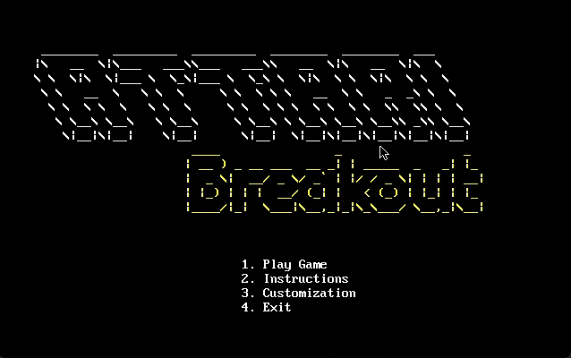
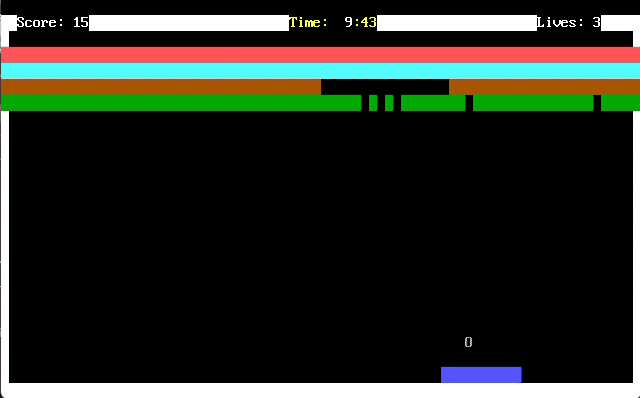
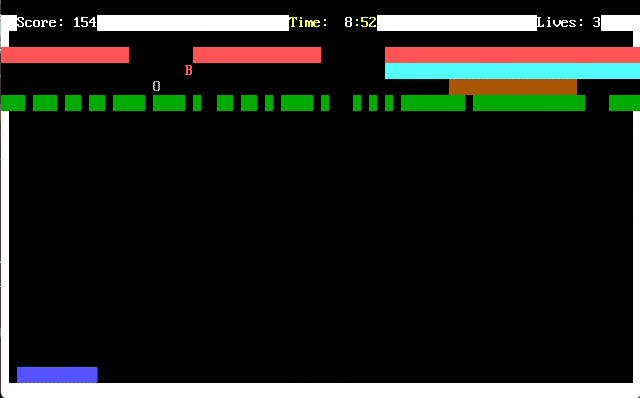
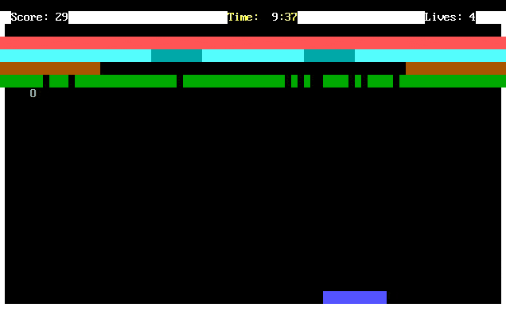
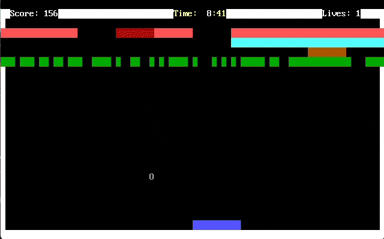

<div align="center">



</div>

---

## 🎮 Overview

**Attari Breakout** is a **single-player x86 Assembly (NASM) console game** — a classic brick-breaking arcade game built entirely in low-level assembly. Control a paddle, bounce a ball, and smash through four rows of color-coded bricks while collecting power-ups, dodging curses, and racing a 10-minute countdown timer.

Built as a COAL (Computer Organization & Assembly Language) final lab project, this game demonstrates direct video memory manipulation, BIOS/DOS interrupt programming, and real-time physics — all without a single external library.

---

## ✨ Features

🕹️ **Paddle Movement:** `←` `→` Arrow Keys
⏸️ **Pause/Unpause:** `P`
🚪 **Exit to Menu:** `ESC`
⏱️ **10-Minute Countdown Timer**
❤️ **3 Lives** (expandable up to 9)
🏆 **High Score Tracking** (persistent)

**🧱 Multi-Hit Bricks (4 rows, 40 bricks):**

| Color | Hits | Points (destroy) | Bonus/Hit |
|-------|------|-------------------|-----------|
| 🔴 Red | 4 | 15 | +1 |
| 🔵 Cyan | 3 | 10 | +1 |
| 🟡 Yellow | 2 | 5 | +1 |
| 🟢 Green | 1 | 2 | +1 |

**⚡ Power-Ups (15 per game):**

- 🟩 `L` — Large Paddle (30s)
- 💣 `B` — Bomb Ball (3×3 explosion radius)
- 🛡️ `S` — Shield (30s, no life loss)
- ❤️ `H` — Heart (extra life, max 9)

**☠️ Curses (7 per game — avoid!):**

- 🌀 `M` — Multi Balls (up to 3 extra balls, 30s)
- 🔥 `F` — Speed Up (30s)
- 💀 `D` — Death (instant life loss)

**🎨 Customization:** Choose Ball & Paddle colors — White, Grey, Blue, or Red, persists through the session.

---

<div align="center">


</div>

---

## 🧱 Gameplay

<div align="center">



<br>
<sub>Paddle-and-ball physics with multi-hit bricks chipping away row by row</sub>

</div>

---

## ⚡ Power-Ups & Curses in Action

<div align="center">



<br>
<sub>Letters fall from broken bricks — catch the green ones, dodge the red curses</sub>

</div>

---

## ⏸️ Pause Anytime

<div align="center">



<br>
<sub>Hit <code>P</code> to freeze the action mid-game — notice the shield's yellow border kick in right after</sub>

</div>

---

## 🕹️ How to Play

1. Launch the game with **DOSBox** (or any DOS-compatible environment).
2. From the **Main Menu**, choose:
   - **1. Play Game** — start immediately
   - **2. Instructions** — view detailed rules
   - **3. Customization** — set ball & paddle colors
   - **4. Exit** — quit
3. Move the paddle with **LEFT / RIGHT** arrows.
4. Press **P** to pause, **ESC** to return to the menu.
5. Destroy all 40 bricks before the timer hits **0:00** — and don't lose all your lives.
6. Catch green power-up letters, dodge red curse letters.

---

## 🛠️ Technical Details

**Language:** x86 Assembly (NASM syntax)
**Target:** 16-bit real mode, `.com` binary (DOS / DOSBox)

**BIOS/DOS Interrupts:**

- `INT 10h` — Video services (set mode, cursor, string output)
- `INT 16h` — Keyboard input (read/check keystroke)
- `INT 1Ah` — System timer (randomization & timing)
- `INT 21h` — DOS services (program termination)
- `Port 42h / 43h / 61h` — PC Speaker (sound effects)

**Core Mechanics:**

- **Rendering:** Direct video memory writes at segment `0xB800`, 80×25 text mode (Mode 03h)
- **Collision Detection:** Coordinate-to-index mapping for ball↔brick; 5-zone paddle system for bounce angle control; boundary checks for walls
- **Multi-Ball System:** Up to 4 simultaneous balls with independent physics
- **Timers:** Loop-counter based — game timer (10 min), power-up duration (30s ≈ 5460 loops), ball speed delay
- **Randomization:** `INT 1Ah` system timer seeds power-up/curse placement across bricks
- **Sound:** 9 distinct PC Speaker tone sequences (paddle hit, brick hit/destroy, power-up, curse, explosion, game over, win, start)

**Key Procedures:** `initGame`, `drawBricks`, `moveBall` (+`2/3/4`), `checkBricks` (+`2/3/4`), `explodeBombBall`, `activatePowerup` (and per-type handlers), `updateTimer`, `drawStatus`, `playTone` (and per-event sound wrappers)

---

## 💻 System Requirements

- x86-compatible CPU (8086+)
- 640 KB RAM minimum
- VGA-compatible display (text mode 80×25)
- DOS or DOSBox emulator
- NASM (Netwide Assembler)

---

## ⚙️ Build & Run

```bash
nasm -f bin Project.asm -o breakout.com
```

Then run it in DOS or DOSBox:

```bash
breakout.com
```

---

## 🏁 Game Rules Summary

**Objective:** Destroy all 40 bricks before time runs out, with at least 1 life remaining.

**Win:** All bricks destroyed → Victory 🏆
**Lose:** Lives reach 0, or timer hits 0:00 → Game Over

---

<div align="center">



**Made with 🧱, ☕, and a lot of NASM debugging**

</div>
